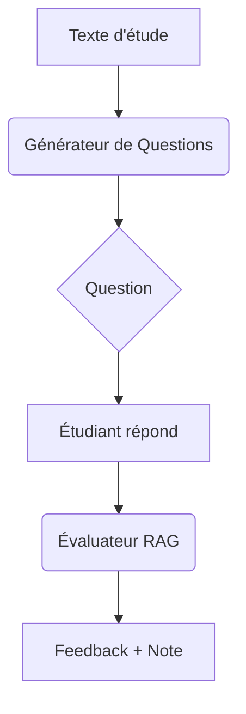

# 🧠 Évaluateur de Réponses RAG et Générateur de Questions GGUF

Deux applications complémentaires pour l'éducation :
1. **Évaluateur RAG** : Évalue les réponses d'étudiants avec feedback détaillé
2. **Générateur de Questions** : Crée des questions pédagogiques en français

---

## 🖼️ Architecture du Projet

### 📁 Evaluator - RAG
```plaintext
- [ ] .env-example
- [ ] README.md
- [ ] data.jsonl
- [ ] rag_app.py
- [ ] requirements.txt
```

### 📁 Question Generator - GGUF
```plaintext
- [ ] README.md
- [ ] app.py          # (anciennement app-update.py)
- [ ] notebook/
- [ ] .gitignore
- [ ] requirements.txt
```

---

## 🚀 Comment Démarrer

### Évaluateur RAG
```bash
cd Evaluator-RAG
pip install -r requirements.txt
cp .env-example .env  # Ajoutez votre GROQ_API_KEY
python rag_app.py
```

### Générateur de Questions
```bash
cd QuestionGenerator-GGUF
pip install -r requirements.txt
python app.py
```

---

## 🔍 Fonctionnalités des Deux Applications

### 1. Évaluateur RAG
- Évalue les réponses d'étudiants sur 10
- Donne un feedback détaillé avec correction
- Utilise Groq LLM + FAISS + RAG

**Endpoint** : `POST /evaluate_answer`
```json
{
  "text": "Le cycle de l'eau...",
  "question": "Nommez les étapes du cycle de l'eau",
  "student_answer": "Évaporation et précipitation"
}
```

### 2. Générateur de Questions
- Génère des questions pertinentes en français
- Utilise des modèles GGUF optimisés
- Spécialisé en contexte éducatif

**Endpoint** : `POST /generate_question`
```json
{
  "text": "La photosynthèse est un processus..."
}
```

---

## 🛠️ Stack Technologique Combinée

| Composant               | Évaluateur RAG          | Générateur de Questions |
|-------------------------|-------------------------|-------------------------|
| **Framework**           | Flask                   | Flask                   |
| **Modèles LLM**         | Groq (DeepSeek-LLaMA)   | GGUF (Qwen quantifié)   |
| **Traitement NLP**      | LangChain, FAISS        | llama_cpp, Hugging Face |
| **Embeddings**          | SentenceTransformer     | SentencePiece           |
| **Langue**              | Multilingue             | Français optimisé       |

---

## 📊 Flux de Travail Complet



---

## 💡 Cas d'Usage Éducatif

1. **Création d'examens** :
   - Générer des questions automatiquement
   - Évaluer les réponses en masse
   
2. **Tutoriels interactifs** :
   ```python
   # Workflow d'intégration
   question = generate_question(chapitre)
   correction = evaluate_answer(question, réponse_étudiant)
   ```
   
3. **Adaptation au niveau** :
   - Générer des questions par difficulté
   - Feedback personnalisé selon les erreurs

---

## ⚠️ Notes Importantes

1. Pour l'Évaluateur RAG :
   ```bash
   GROQ_API_KEY=your_key_here  # Dans .env
   ```

2. Pour le Générateur de Questions :
   - Premier lancement long (téléchargement modèle ~4GB)
   - Nécessite 4GB+ RAM

3. Structure des données :
   ```json
   // data.jsonl (RAG)
   {"text": "Contenu pédagogique..."}
   ```

---

## 📚 Ressources Pédagogiques

| Outil                  | Documentation Officielle |
|------------------------|--------------------------|
| **LangChain**          | [langchain.com](https://python.langchain.com) |
| **llama.cpp**          | [github.com/ggerganov/llama.cpp](https://github.com/ggerganov/llama.cpp) |
| **Hugging Face Hub**   | [huggingface.co/docs/hub](https://huggingface.co/docs/hub) |
